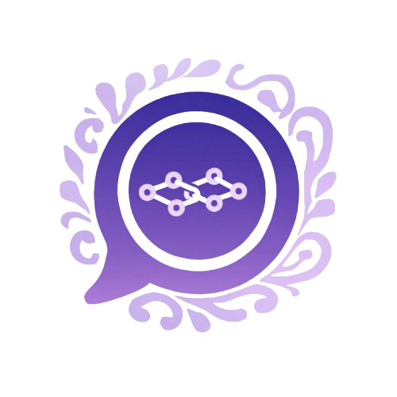

<p align="center">
   
 </p>
 
 # Ling
 
 Ling 是一个用 Go 构建的组件化 LLM/RAG 工具箱，提供可组合的流水线能力（censor / self-query / rewrite / expand / retrieval / compress / answer），并支持 MCP（Model Context Protocol）工具调用。

 ## 特性
 
 - **RAG 检索链路**
   支持向量检索、关键词检索与 hybrid 融合（`pkg/retrieval` + `pkg/knowledge`）
 - **组件化 Pipeline**
   可按需串联：内容安全（`pkg/censor`）、查询扩展（`pkg/expand`）、查询重写（`pkg/rewrite`）、上下文压缩（`pkg/compress`）等
 - **Self-Query（自查询）**
   从自然语言问题中抽取 `Query + Filters`，Filters 直接兼容 `knowledge.QueryOptions.Filters`（`pkg/selfquery`）
 - **MCP 客户端封装**
   支持 stdio 子进程与 HTTP 传输（`pkg/mcp`）
 
 ## 仓库结构（核心目录）
 
 - **`cmd/`**
   示例程序入口（`go run ./cmd/...`）
 - **`pkg/`**
   可复用组件包：`llm` / `knowledge` / `retrieval` / `censor` / `expand` / `rewrite` / `compress` / `selfquery` / `mcp` 等
 - **`docs/`**
   文档与资源（含 `docs/logo.png`）
 
 ## 快速开始

### 1) 环境变量

`cmd/server` 会加载 `.env`（如果存在），并读取以下变量（见 `internal/config/configs.go`）：

- **`MODE`**
- **`BASE_URL`**
- **`API_KEY`**
- **`MODEL`**

示例：

```bash
export MODE=dev
export BASE_URL=https://api.openai.com/v1
export API_KEY=YOUR_KEY
export MODEL=gpt-4.1-mini
```

### 2) 构建与测试

```bash
go test ./...
```

### 3) 运行示例

- **`cmd/server`**（当前示例：只演示加载配置）

```bash
go run ./cmd/server
```

- **MCP 示例**

```bash
go run ./cmd/mcp_llm_test
go run ./cmd/mcp_http_llm_test
```

- **RAG 链路示例（按目录名）**

```bash
go run ./cmd/hybrid_test
go run ./cmd/compress_test
go run ./cmd/rewrite_test
go run ./cmd/expand_test
```

## 文档
- **架构说明（含 Mermaid 图）**
  `docs/architecture.md`